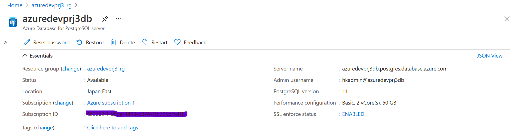
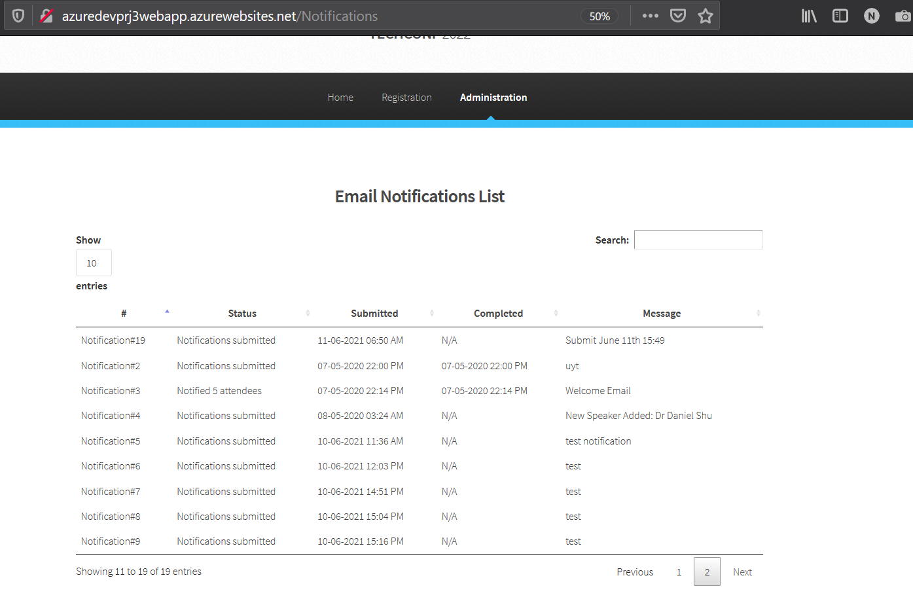

# TechConf Registration Website

## Project Overview
The TechConf website allows attendees to register for an upcoming conference. Administrators can also view the list of attendees and notify all attendees via a personalized email message.

The application is currently working but the following pain points have triggered the need for migration to Azure:
 - The web application is not scalable to handle user load at peak
 - When the admin sends out notifications, it's currently taking a long time because it's looping through all attendees, resulting in some HTTP timeout exceptions
 - The current architecture is not cost-effective 

In this project, you are tasked to do the following:
- Migrate and deploy the pre-existing web app to an Azure App Service
- Migrate a PostgreSQL database backup to an Azure Postgres database instance
- Refactor the notification logic to an Azure Function via a service bus queue message

## Dependencies

You will need to install the following locally:
- [Postgres](https://www.postgresql.org/download/)
- [Visual Studio Code](https://code.visualstudio.com/download)
- [Azure Function tools V3](https://docs.microsoft.com/en-us/azure/azure-functions/functions-run-local?tabs=windows%2Ccsharp%2Cbash#install-the-azure-functions-core-tools)
- [Azure CLI](https://docs.microsoft.com/en-us/cli/azure/install-azure-cli?view=azure-cli-latest)
- [Azure Tools for Visual Studio Code](https://marketplace.visualstudio.com/items?itemName=ms-vscode.vscode-node-azure-pack)

## Project Instructions

### Part 1: Create Azure Resources and Deploy Web App
1. Create a Resource group
2. Create an Azure Postgres Database single server
   - Add a new database `techconfdb`
   - Allow all IPs to connect to database server
   - Restore the database with the backup located in the data folder
3. Create a Service Bus resource with a `notificationqueue` that will be used to communicate between the web and the function
   - Open the web folder and update the following in the `config.py` file
      - `POSTGRES_URL`
      - `POSTGRES_USER`
      - `POSTGRES_PW`
      - `POSTGRES_DB`
      - `SERVICE_BUS_CONNECTION_STRING`
4. Create App Service plan
5. Create a storage account
6. Deploy the web app

### Part 2: Create and Publish Azure Function
1. Create an Azure Function in the `function` folder that is triggered by the service bus queue created in Part 1.

      **Note**: Skeleton code has been provided in the **README** file located in the `function` folder. You will need to copy/paste this code into the `__init.py__` file in the `function` folder.
      - The Azure Function should do the following:
         - Process the message which is the `notification_id`
         - Query the database using `psycopg2` library for the given notification to retrieve the subject and message
         - Query the database to retrieve a list of attendees (**email** and **first name**)
         - Loop through each attendee and send a personalized subject message
         - After the notification, update the notification status with the total number of attendees notified
2. Publish the Azure Function

### Part 3: Refactor `routes.py`
1. Refactor the post logic in `web/app/routes.py -> notification()` using servicebus `queue_client`:
   - The notification method on POST should save the notification object and queue the notification id for the function to pick it up
2. Re-deploy the web app to publish changes


## Set up environment

```
az group create --name azuredevprj3_rg --location japaneast--subscription "Azure subscription 1"
#az sql server create --name azuredevprj3sqlserver --resource-group azuredevprj3_rg --location japaneast --enable-public-network true --admin-user hkadmin --admin-password <your password>
#az sql db create --name azuredevprj3_sqldb --server azuredevprj3sqlserver  --resource-group azuredevprj3_rg --backup-storage-redundancy Local --edition Basic  --max-size 2GB --zone-redundant false

az postgres server create --name azuredevprj3db  --resource-group azuredevprj3_rg --location japaneast --admin-user hkadmin --sku-name B_Gen5_1 --ssl-enforcement Enabled --minimal-tls-version TLS1_0 --public-network-access Enabled --backup-retention 7 --geo-redundant-backup Disabled --storage-size 5120 --version 11
createdb -h azuredevprj3db.postgres.database.azure.com -p 5432 -U hkadmin@azuredevprj3db techconfdb
pg_restore -h azuredevprj3db.postgres.database.azure.com -p 5432 --no-tablespaces -W -O -F t -x -d techconfdb -U hkadmin@azuredevprj3db ./techconfdb_backup.tar

az servicebus namespace create --resource-group azuredevprj3_rg --name azuredevprj3sbns --location japaneast --sku Basic
az servicebus queue create --resource-group azuredevprj3_rg --namespace-name azuredevprj3sbns --name notificationqueue

az servicebus namespace authorization-rule keys list --resource-group azuredevprj3_rg --namespace-name azuredevprj3sbns --name RootManageSharedAccessKey --query primaryConnectionString --output tsv

az appservice plan create --resource-group azuredevprj3_rg --name azuredevprj3splan --location japaneast --sku F1 --is-linux
az webapp create --resource-group azuredevprj3_rg  --plan azuredevprj3splan --name azuredevprj3webapp --runtime "python|3.8"
az storage account create --name azuredevprj3storage --resource-group azuredevprj3_rg --location japaneast --sku Standard_LRS
az functionapp create --functions-version 3 --resource-group azuredevprj3_rg --name azuredevprj3func --storage-account azuredevprj3storage --os-type Linux --consumption-plan-location japaneast --runtime python --runtime-version 3.8

```

## Screenshots

My Resource group


### Migrate Web Applications

#### Create an Azure App resource in a free tier app service plan

*Student provides a screenshot of the Azure resource showing the app service plan*


#### Web App code deployed in Azure

*Student provides a screenshot of the application successfully running with the URL in this format https://\*.azurewebsites.net The screenshot should be fullscreen showing the URL and application running.*

In the portal.


Running app.


### Migrate Database

#### Create an Azure Postgres database in Azure
*Student provides a screenshot of the Azure Postgres database resource created in Azure showing the database name, version, server name*



#### Restore database backup to Azure Postgres database
*Student provides a screenshot of the web app successfully loading the list of attendees and notifications from the deployed website*

Attendees


Notifications


### Migrate Background Process
#### Create an Azure Function resource for the migration
*Student provides a screenshot of the Azure Function app running in Azure showing the function name and the function app plan*


#### Azure function code implemented, deployed, and triggered
*Student provides screenshots of the following showing functionality of the deployed site:*
- *Submitting a new notification*
- *\Notification processed after executing the Azure function*

Creating a notification on 2021-06-11 06:50:10.050 UTC (2021-06-11 15:49 JST)


In the notification list. The Copmoleted field is N/A soon after the notification is created.


Notification is processed in Service Bus


Function is triggered successfully on 2021-06-11 06:50:10.050 UTC (2021-06-11 15:50:10.050 JST)


The function process logs.


The postgres proces logs.
```
2021-06-11 06:50:11 UTC-60c307a3.b51c-LOG:  connection received: host=************** port=3107 pid=46364
2021-06-11 06:50:11 UTC-60c307a3.b51c-LOG:  connection authorized: user=hkadmindatabase=techconfdb SSL enabled (protocol=TLSv1.2, cipher=ECDHE-RSA-AES256-GCM-SHA384, compression=off)
2021-06-11 06:50:14 UTC-60c307a3.b51c-LOG:  could not receive data from client: An existing connection was forcibly closed by the remote host.
```
By refreshing the page, we can see that the *Notification#19* is updated with Completed date/time.


## Monthly Cost Analysis
Complete a month cost analysis of each Azure resource to give an estimate total cost using the table below:

| Azure Resource | Service Tier | Monthly Cost |
| ------------ | ------------ | ------------ |
| Azure Postgres Database | Basic | $30 (3,000JPY) |
| Azure Service Bus | Basic | $0.05 |
| App Service Plan and App | Consumption Plan | F1 (Free) |
| Function App | Consumption Plan | Free |
| Web App | Consumption Plan | Free |
| Storage Account | Standard_LRS | $0.01|

references
(Please also see the az commands to launch services. Especially in the *--sku* options.)

Total


Storage Account

## Architecture Explanation

*Student provides a README that includes a short explanation and reasoning of the architecture selected for both the Azure web app and the Azure function in terms of cost-effectiveness*

Web App is suitable in this case:
- Light weight Flask app, with a few pages and simple extractin db.
- Easily runs with python, without further configuration of the environment. Advancement to VMs.
- Quickly deployed
- No intensive workload and scale management is not needed.
- Runs withing an F1 (Free) tier for this testing.

Function app enables offloading time consuming process from Web App by using the service bus:
- the synchronized process to update DB entries, so users don't need to wait in the Web Page transitions.
- The synchronized process of sending mails is offloaded. For users, mails are sent in the backend.
- This makes the architecture easier to scale with larger active user cases.